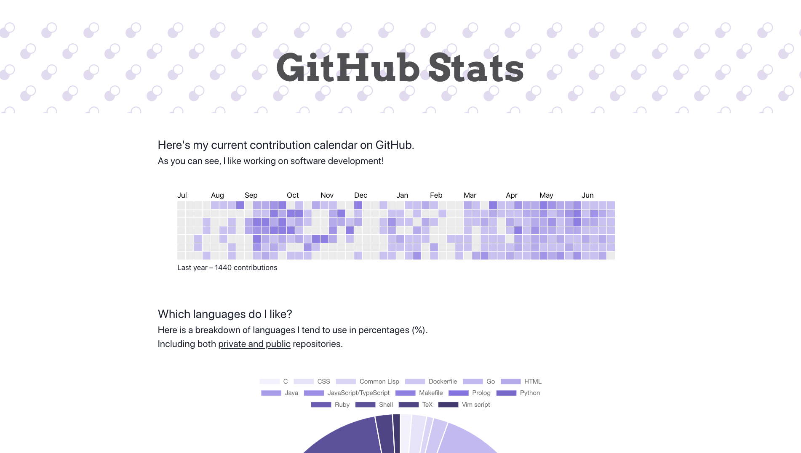

# GitHub Stats

## Description

Grabs information about my commits and languages used in (private and public) projects and displays them using charts on the web.

---

## Screenshot

## Built with / technologies

* Next.js (React.js)
* Flask RESTful (Python)
* Drone CI
* Nginx
* Chakra UI
* MongoDB
* Docker & Docker Swarm

## Development

### Prerequisites

* Python 3.8
* Node.js 14
* Docker 19
* Docker-compose 1.25

### Running the project

The project is split into 4 services: backend, frontend, scraper and proxy.

`backend` and `scraper` are written in Python and need to have the packages installed. From their respective directories, you can install the requirements with `make install`. To run, `make run`.

`frontend` is written in TypeScript. Install packages with `npm install` and run the dev server with `npm run dev`.

`proxy` holds the configuration for Nginx.

From the root directory, you can start up all the services with docker-compose with `make up`.

## Roadmap

Check out the [open issues](https://github.com/gordonpn/github-stats/issues?q=is%3Aissue+is%3Aopen+sort%3Aupdated-desc) for ideas and features I have planned!

## Support

You may open an issue for discussion.

## Authors

Myself [@gordonpn](https://github.com/gordonpn)

## License

[MIT License](./LICENSE)
